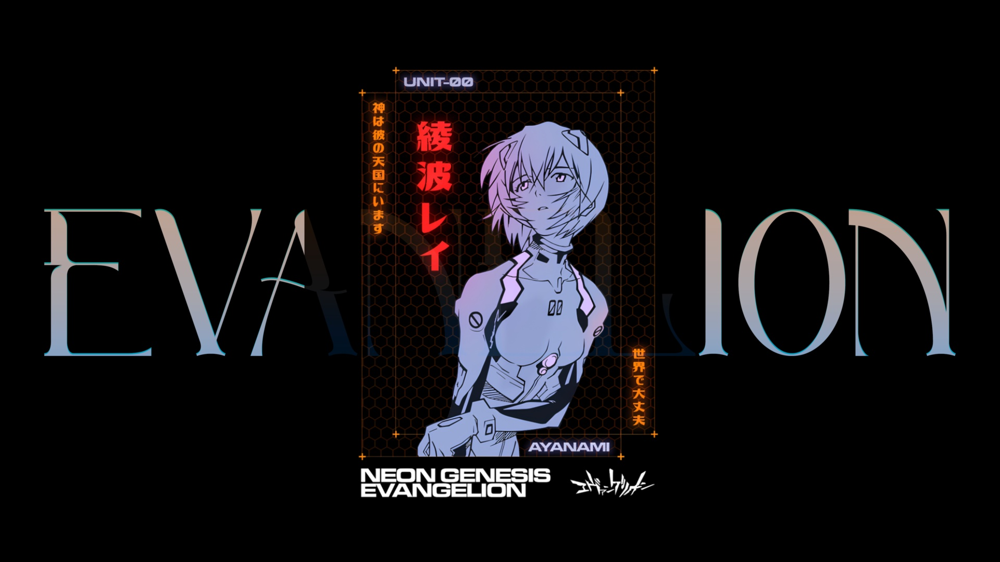

<div align="center">

# 🍃 mint-catppuccin

**Aesthetic Linux Mint Cinnamon Rice • Catppuccin Flamingo Dark • Caelestia Suite**

[-87CF3E?style=flat-square&logo=linux-mint&logoColor=white)](https://linuxmint.com/)
[](https://github.com/linuxmint/cinnamon)
[](https://github.com/catppuccin/catppuccin)
[](https://sw.kovidgoyal.net/kitty/)
[](https://starship.rs/)
[](LICENSE)

*Dotfiles dan konfigurasi ricing personal untuk Linux Mint Cinnamon dengan tampilan modern, clean, dan kohesif bernuansa Catppuccin.*

[Fitur](#-fitur-utama) • [Spesifikasi](#-spesifikasi-ricing) • [Instalasi](#-instalasi) • [Struktur](#-struktur-repositori) • [Pintasan](#-shortcut--keybindings)

</div>

---

## 📸 Showcase

> *Simpan screenshot desktop Anda di `assets/screenshots/` dan tautkan di sini!*

| 🖥️ Desktop Overview | 🎛️ Caelestia Control & OSD |
|:---:|:---:|
|  |  |

| 💻 Terminal & Fastfetch | 📋 Bento Clipboard & Widgets |
|:---:|:---:|
|  |  |

---

## ✨ Fitur Utama

- **🎨 Catppuccin Flamingo Palette:** Tema warna harmonis yang diterapkan menyeluruh pada GTK, Cinnamon panel, kursor, terminal Kitty, Starship, Btop, dan Cava.
- **✨ Caelestia Desktop Suite (Web-Tech on Desktop):**
  - **`caelestia-control`**: Control center modern untuk quick settings, audio volume, display, dan status baterai.
  - **`caelestia-clip`**: Clipboard manager dengan antarmuka Bento grid yang elegan.
  - **`caelestia-osd`**: Modern floating pill OSD untuk indikator volume dan brightness.
  - **`caelestia-lock`**: Lockscreen elegan dengan jam, avatar, dan statistik.
  - **`caelestia-power`**: Menu daya (Power Off, Reboot, Suspend, Lock).
  - **`caelestia-wallpaper`**: Bento wallpaper switcher daemon dengan dukungan wallpaper per-workspace.
- **🧩 Custom Cinnamon Applets (`@df`):**
  - `menu-search@df`: Menu launcher cepat minimalis.
  - `workspace-nano@df`: Workspace switcher ringkas berbentuk pill.
  - `hwmonitor@df`: Monitoring CPU & RAM real-time di panel.
  - `power-button@df`: Tombol power minimalis di sudut panel.
  - `storage-monitor@df`: Indikator penggunaan disk.
- **⚡ Supercharged Terminal:** Kitty terminal dengan rendering grafis langsung Fastfetch, Starship prompt, dan btop hardware monitor.
- **⚓ Floating Dock:** Plank dock bertema gelap transparan di bagian bawah layar.

---

## 🛠 Spesifikasi Ricing

| Komponen | Pilihan / Konfigurasi |
| :--- | :--- |
| **Distro OS** | Linux Mint 22.x (Zena / Ubuntu 24.04 LTS) |
| **Desktop Environment** | Cinnamon |
| **GTK Theme** | Catppuccin-Flamingo-Dark |
| **Icon Theme** | Papirus-Dark |
| **Cursor Theme** | catppuccin-mocha-flamingo-cursors |
| **Terminal Emulator** | Kitty |
| **Shell & Prompt** | Bash + Starship |
| **System Fetch** | Fastfetch (Kitty Direct Protocol + Eva graphic) |
| **Resource Monitor** | btop (Catppuccin theme) |
| **Audio Visualizer** | Cava |
| **Lyrics Display** | Sptlrx (MPRIS synced) |
| **Dock** | Plank (dock1) |

---

## 📦 Instalasi

### 1. Clone Repositori
```bash
git clone https://github.com/<username>/mint-catppuccin.git
cd mint-catppuccin
```

### 2. Jalankan Installer Interaktif
```bash
./install.sh
```

Installer menyediakan beberapa opsi:
1. **Full Install (Rekomendasi):** Mengunduh paket dependensi sistem via `apt`, mencadangkan konfigurasi lama Anda ke `~/.dotfiles_backup/`, memasang semua file `.config`, `.local`, tema GTK, dan memulihkan pengaturan dconf Cinnamon.
2. **Konfigurasi Saja:** Hanya menyalin file konfigurasi tanpa mengubah paket sistem.
3. **Dconf Saja:** Hanya memulihkan pengaturan layout panel, tema, dan shortcuts.

### 3. Terapkan Perubahan
Setelah instalasi selesai, muat ulang Cinnamon:
- Tekan `Alt + F2`, ketik `r`, lalu tekan `Enter`.
- Atau logout dan login kembali ke sesi Anda.

---

## 📂 Struktur Repositori

```text
mint-catppuccin/
├── .config/
│   ├── autostart/             # Autostart Caelestia daemons & Plank
│   ├── bento-wallpaper/       # Workspace wallpaper mapping
│   ├── btop/                  # btop.conf + Catppuccin theme
│   ├── cava/                  # Audio visualizer config
│   ├── fastfetch/             # Fastfetch config & ASCII art
│   ├── kitty/                 # Kitty terminal config & themes
│   ├── plank/                 # Dock launchers & settings
│   ├── sptlrx/                # MPRIS synchronized lyrics config
│   └── starship.toml          # Catppuccin Starship prompt
├── .local/
│   ├── bin/                   # Utility scripts & Caelestia launchers
│   └── share/
│       ├── caelestia-*        # Caelestia desktop suite (Python + WebKit/HTML)
│       └── cinnamon/applets/  # Custom Cinnamon applets karya @df
├── dconf/
│   ├── cinnamon.dconf         # Export setting panel, applet, dan tema
│   ├── gnome-interface.dconf  # Export tema GTK, font, dan kursor
│   └── plank.dconf            # Export pengaturan dock Plank
├── themes/
│   └── Catppuccin-Flamingo-Dark/  # Tema GTK lengkap
├── assets/
│   ├── wallpapers/            # Koleksi wallpaper default & per-workspace
│   └── icons/                 # Logo Fastfetch (eva.png)
├── install.sh                 # Skrip instalasi otomatis & aman
├── .gitignore                 # Filter cache, history db, dan file temporary
├── LICENSE                    # MIT License
└── README.md                  # Dokumentasi proyek
```

---

## ⌨️ Shortcut & Keybindings

| Aksi | Perintah / Skrip |
| :--- | :--- |
| **Control Center** | `caelestia-control` |
| **Clipboard History** | `caelestia-clip` |
| **Lock Screen** | `caelestia-lock` |
| **Power Menu** | `caelestia-power` |
| **Wallpaper Switcher**| `caelestia-wallpaper` |
| **Auto Tiling Toggle**| `cinnamon-autotile.py` |
| **Fast Kitty Terminal**| `kitty-fast` |

*Tips:* Anda dapat menetapkan tombol pintasan (*Keyboard Shortcuts*) untuk perintah-perintah di atas melalui menu **Settings > Keyboard > Shortcuts > Custom Shortcuts**.

---

## 🔒 Privasi & Keamanan
Repositori ini telah dikonfigurasi dengan `.gitignore` yang ketat:
- Riwayat salinan clipboard pribadi (`clipboard.db`) tidak disertakan.
- Direktori cache Python (`__pycache__`) otomatis diabaikan.
- Tidak ada token personal atau file sementara yang di-commit.

---

## 🤝 Kontribusi & Lisensi
Proyek ini dilisensikan di bawah [MIT License](LICENSE). Silakan gunakan, fork, atau modifikasi sesuai kebutuhan ricingan Anda!
