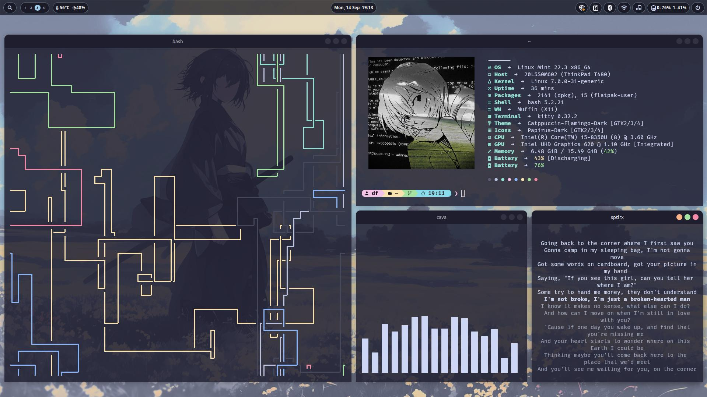

<div align="center">

# mint-catppuccin

**Aesthetic Linux Mint Cinnamon Rice • Dynamic Catppuccin Palette**

[-87CF3E?style=flat-square&logo=linux-mint&logoColor=white)](https://linuxmint.com/) [](https://github.com/linuxmint/cinnamon) [](https://sw.kovidgoyal.net/kitty/) [](LICENSE)

*Personal dotfiles and ricing configuration for Linux Mint Cinnamon featuring a dark Catppuccin Mocha base paired with a dynamic pastel theme engine that harmonizes with per-workspace wallpapers.*

[Showcase](#showcase) • [Features](#key-features) • [Specifications](#ricing-specifications) • [Installation](#installation) • [Repository Structure](#repository-structure) • [Keybindings](#shortcuts--commands)

</div>

---

## Showcase

<div align="center">



</div>

---

## Key Features

- **Dynamic Catppuccin Theme:** Built on a dark Catppuccin Mocha base (`Catppuccin-Flamingo-Dark` GTK, `Papirus-Dark` icons, and `catppuccin-mocha-flamingo` cursor), enhanced by a dynamic color extraction engine that automatically samples wallpaper tones into soft Catppuccin pastel accents.
- **Custom Cinnamon Applets:**
  - **Menu Search**: Fast application search and launcher on the left panel.
  - **Workspace Nano**: Minimalist pill-shaped workspace switcher.
  - **Hardware Monitor**: Real-time CPU temperature and RAM usage indicator.
  - **Power Button**: Quick session control button on the right panel.
  - **Storage Monitor** *(optional)*: Real-time disk storage indicator.
- **Bento Desktop Modules:**
  - **`bento-control`**: Unified control center for toggling Wi-Fi, Bluetooth, Night Light, DND, volume, display brightness, and MPRIS music player.
  - **`bento-clip`**: Modern grid clipboard manager with search history and image preview support.
  - **`bento-osd`**: Floating pill on-screen display for volume and brightness feedback.
  - **`bento-lock`**: Aesthetic lock screen integrated with screensaver proxy and password-protected power actions.
  - **`bento-power`**: Clean session and power menu (Lock, Suspend, Reboot, Shutdown).
  - **`bento-wallpaper`**: Per-workspace wallpaper daemon with an instant Dynamic Theme Engine that extracts palette colors and broadcasts accent updates.
- **Terminal & CLI Experience:**
  - **Kitty Terminal**: GPU-accelerated terminal with FiraCode Nerd Font Mono and Catppuccin Mocha color scheme.
  - **Fastfetch**: System information fetch with Kitty direct graphics protocol rendering.
  - **Starship Prompt**: Minimalist, responsive shell prompt displaying current directory, Git status, and timestamp.
  - **pipes.sh**: Retro animated terminal screensaver tuned to pastel Catppuccin colors.
  - **Btop**: Interactive system resource monitor styled in Catppuccin theme.
  - **Cava & Sptlrx**: Audio visualizer bar and synchronized live music lyrics via MPRIS.
- **Floating Dock:** Clean, transparent Plank dock with intelligent auto-hide to avoid obstructing active windows or tiling layouts.

---

## Ricing Specifications

| Component | Choice / Configuration |
| :--- | :--- |
| **Distribution** | Linux Mint 22.x (Zena) |
| **Desktop Environment** | Cinnamon |
| **Window Manager** | Muffin (X11) |
| **GTK Theme** | Catppuccin-Flamingo-Dark (Mocha Base) |
| **Color Scheme** | Dynamic Catppuccin (Wallpaper-Adaptive) |
| **Icon Theme** | Papirus-Dark |
| **Cursor Theme** | catppuccin-mocha-flamingo-cursors |
| **Terminal** | Kitty |
| **Terminal Font** | FiraCode Nerd Font Mono |
| **System Font** | Ubuntu 10 |
| **Shell & Prompt** | Bash + Starship |
| **System Fetch** | Fastfetch (Kitty Direct Graphics) |
| **Terminal Screensaver** | pipes.sh |
| **Resource Monitor** | btop |
| **Audio Visualizer** | Cava |
| **Lyrics Display** | Sptlrx |
| **Dock** | Plank (Intelligent Hide) |

---

## Installation

### 1. Clone the Repository
```bash
git clone https://github.com/Dimasbdev/Mint_Catpuccin.git
cd Mint_Catpuccin
```

### 2. Run the Interactive Installer
```bash
./install.sh
```

The installer provides the following options:
1. **Full Install (Recommended):** Verifies and installs required dependencies via `apt`, creates a timestamped backup of existing configs in `~/.dotfiles_backup/`, deploys all files to `.config`, `.local`, GTK themes, wallpapers, and restores Cinnamon settings via `dconf`.
2. **Config Only:** Deploys configuration files without modifying system packages.
3. **Dconf Only:** Restores Cinnamon panel layouts, applets, shortcuts, and themes only.
4. **Install Packages Only:** Installs required system dependencies via `apt` without touching user configs.

### 3. Apply Changes
After installation completes, reload Cinnamon:
- Press `Alt + F2`, type `r`, and press `Enter`.
- Or log out and log back into your desktop session.

---

## Repository Structure

```text
Mint_Catpuccin/
├── .config/
│   ├── autostart/             # Autostart entries for Bento daemons
│   ├── bento-wallpaper/       # Per-workspace wallpaper mapping
│   ├── btop/                  # btop system monitor Catppuccin config
│   ├── cava/                  # Cava audio visualizer configuration
│   ├── dock-shortcuts.json    # Configurable Super + 1..9 shortcut mapping
│   ├── fastfetch/             # Fastfetch configuration and logos
│   ├── kitty/                 # Kitty terminal config and Mocha theme
│   ├── plank/                 # Plank dock preferences and launchers
│   ├── sptlrx/                # sptlrx live lyrics configuration
│   ├── starship.toml          # Catppuccin Starship prompt config
│   └── systemd/user/          # User background services (clip, lock, kitty, plank)
├── .local/
│   ├── bin/                   # Bento module scripts and utility launchers
│   └── share/
│       ├── bento-*            # Bento UI HTML/JS frontend interfaces
│       └── cinnamon/applets/  # Custom Cinnamon panel applets
├── dconf/
│   ├── cinnamon.dconf         # Cinnamon panels, applets, and theme dconf dump
│   ├── gnome-interface.dconf  # GTK theme, font, and cursor settings
│   └── plank.dconf            # Plank dock preferences and dock items
├── themes/
│   └── Catppuccin-Flamingo-Dark/  # Full GTK2/3/4 & Cinnamon desktop theme
├── assets/
│   ├── screenshots/           # Desktop showcase screenshots
│   ├── wallpapers/            # Default & workspace wallpapers
│   └── icons/                 # Graphic assets
├── install.sh                 # Interactive installation script
├── .gitignore                 # Cache, database history, and temp filters
├── LICENSE                    # MIT License
└── README.md                  # Project documentation
```

---

## Shortcuts & Commands

All keybindings below are **ergonomic default presets**. You can freely customize any shortcut to match your preferred workflow via **System Settings > Keyboard > Shortcuts > Custom Shortcuts**.

| Shortcut | Action / Module | Command |
| :--- | :--- | :--- |
| `Super + C` | **Control Center** | `bento-control` |
| `Super + V` | **Clipboard History** | `bento-clip` |
| `Super + L` | **Lock Screen** | `bento-lock` |
| `Super + Escape` | **Power Menu** | `bento-power` |
| `Super + W` | **Wallpaper Switcher** | `bento-wallpaper` |
| `Super + T` | **Auto-Tiling Toggle** | `cinnamon-autotile.py` |
| `Super + Return` | **Terminal (Kitty)** | `kitty-fast` |
| `Super + 1 .. 9` | **Dock App Quick Launch & Switch** | `dock-launch 1..9` |

### Customizing Dock Shortcuts (`Super + 1 .. 9`)
You can easily change which applications are launched or focused by `Super + 1` through `Super + 9`:
- **View current mappings:**
  ```bash
  dock-launch --list
  ```
- **Set an application for a specific number:**
  ```bash
  dock-launch --set 1 brave-browser
  dock-launch --set 4 code
  ```
- **Automatically sync with your current Plank dock items:**
  ```bash
  dock-launch --sync-plank
  ```
- **Edit configuration directly:**
  ```bash
  dock-launch --edit
  # Or open ~/.config/dock-shortcuts.json in your favorite text editor
  ```

---

## Privacy & Security
- Private clipboard history database (`clipboard.db`) is automatically ignored by `.gitignore`.
- Python cache files (`__pycache__`) and temporary runtime files are excluded from this repository.

---

## License
This project is open-source and licensed under the [MIT License](LICENSE).
