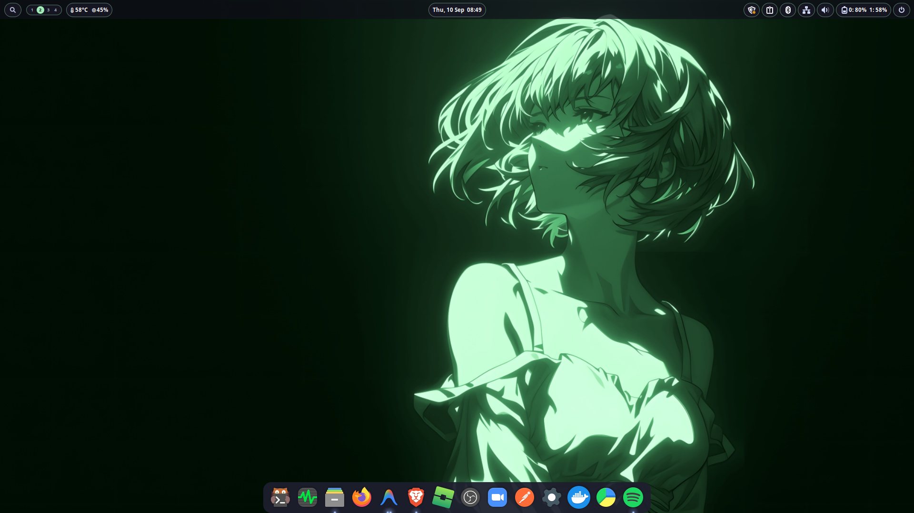
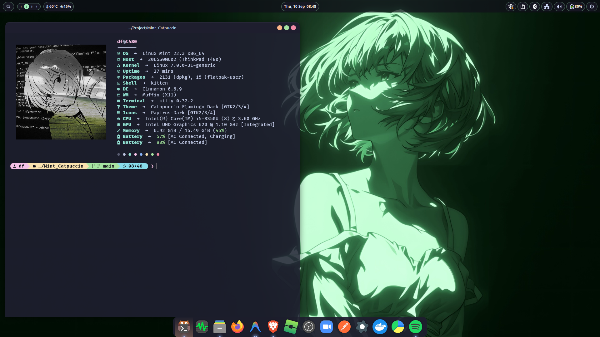
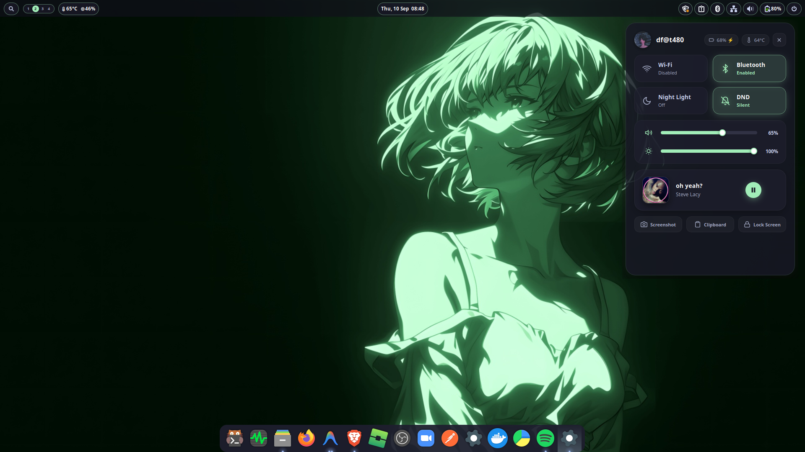
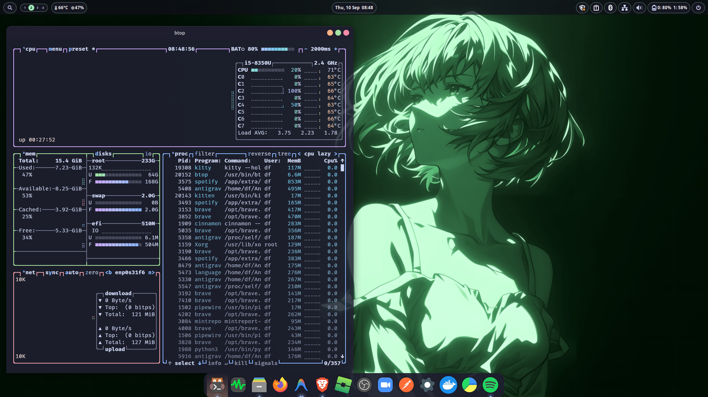
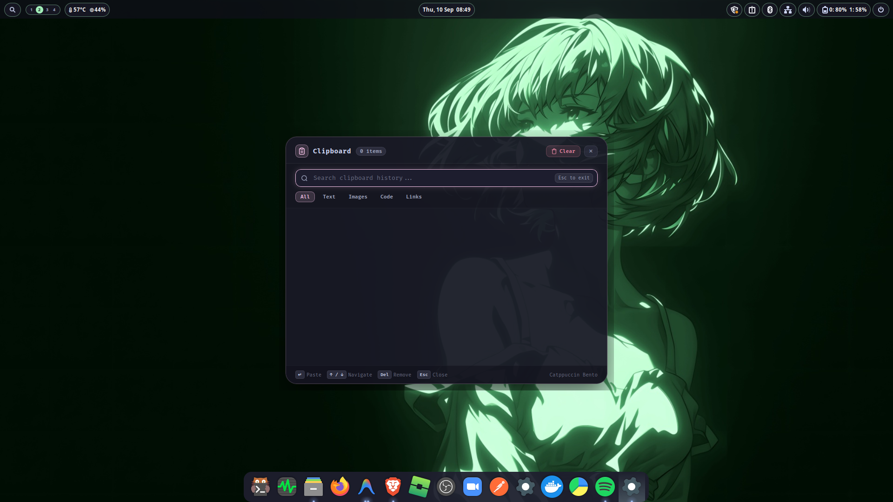
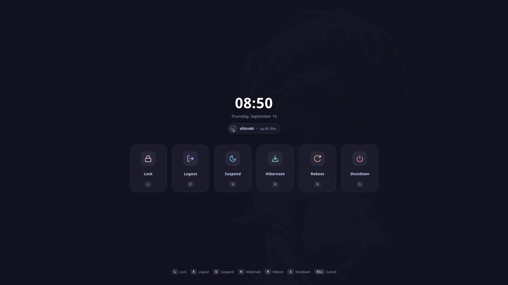

<div align="center">

# 🍃 mint-catppuccin

**Aesthetic Linux Mint Cinnamon Rice • Catppuccin Flamingo Dark**

[-87CF3E?style=flat-square&logo=linux-mint&logoColor=white)](https://linuxmint.com/)
[](https://github.com/linuxmint/cinnamon)
[](https://github.com/catppuccin/catppuccin)
[](https://sw.kovidgoyal.net/kitty/)
[](https://starship.rs/)
[](LICENSE)

*Dotfiles dan konfigurasi ricing personal untuk Linux Mint Cinnamon dengan tampilan modern, bersih, dan kohesif.*

[Showcase](#-showcase) • [Fitur](#-fitur-utama) • [Spesifikasi](#-spesifikasi-ricing) • [Instalasi](#-instalasi) • [Struktur](#-struktur-repositori) • [Pintasan](#-shortcut--perintah)

</div>

---

## 📸 Showcase

<div align="center">

| 🖥️ Desktop Overview | 💻 Fastfetch & Terminal |
|:---:|:---:|
|  |  |

| 🎛️ Control Center & Music | 📊 Btop System Monitor |
|:---:|:---:|
|  |  |

| 📋 Bento Clipboard Manager | ⏻ Power & Session Menu |
|:---:|:---:|
|  |  |

</div>

---

## ✨ Fitur Utama

- **🎨 Tema Catppuccin Flamingo:** Tema GTK dan panel Cinnamon `Catppuccin-Flamingo-Dark`, icon pack `Papirus-Dark`, dan kursor `catppuccin-mocha-flamingo`.
- **🧩 Custom Cinnamon Applets (`@df`):**
  - `menu-search@df`: Menu pencarian aplikasi cepat di panel kiri.
  - `workspace-nano@df`: Switcher workspace minimalis berbentuk pill.
  - `hwmonitor@df`: Monitoring suhu CPU dan penggunaan RAM di panel secara real-time.
  - `storage-monitor@df`: Indikator pemakaian penyimpanan disk.
  - `power-button@df`: Tombol menu power cepat di panel kanan.
- **🖥️ Bento Desktop Modules:**
  - **`bento-control`**: Control Center terpadu untuk toggle Wi-Fi, Bluetooth, Night Light, DND, volume, kecerahan, dan mini player musik.
  - **`bento-clip`**: Clipboard manager berbasis Bento grid dengan pencarian riwayat teks dan gambar.
  - **`bento-osd`**: Floating pill OSD pop-up untuk indikator volume dan brightness.
  - **`bento-lock`**: Layar pengunci estetik dengan avatar, jam digital, dan statistik.
  - **`bento-power`**: Menu session & power (Lock, Logout, Suspend, Hibernate, Reboot, Shutdown).
  - **`bento-wallpaper`**: Daemon pengganti wallpaper dinamis dengan dukungan workspace.
- **⚡ Terminal & CLI Experience:**
  - **Kitty Terminal**: Terminal GPU-accelerated dengan font dan skema warna gelap yang selaras.
  - **Fastfetch**: Info sistem lengkap dengan rendering grafis Kitty direct protocol.
  - **Starship Prompt**: Prompt shell elegan menampilkan direktori, status git, dan waktu.
  - **Btop**: Monitor sistem interaktif bertema pastel Catppuccin.
  - **Cava & Sptlrx**: Audio visualizer bar dan sinkronisasi lirik musik via MPRIS.
- **⚓ Floating Dock:** Dock Plank transparan di bagian bawah layar.

---

## 🛠 Spesifikasi Ricing

| Komponen | Pilihan / Konfigurasi |
| :--- | :--- |
| **Distro** | Linux Mint 22.x (Zena) |
| **Desktop Environment** | Cinnamon |
| **Window Manager** | Muffin (X11) |
| **GTK Theme** | Catppuccin-Flamingo-Dark |
| **Icon Theme** | Papirus-Dark |
| **Cursor Theme** | catppuccin-mocha-flamingo-cursors |
| **Terminal** | Kitty |
| **Shell & Prompt** | Bash + Starship |
| **Fetch Tool** | Fastfetch (Kitty Direct Graphics) |
| **Resource Monitor** | btop |
| **Audio Visualizer** | Cava |
| **Lyrics Display** | Sptlrx |
| **Dock** | Plank |

---

## 📦 Instalasi

### 1. Clone Repositori
```bash
git clone https://github.com/<username>/mint-catppuccin.git
cd mint-catppuccin
```

### 2. Jalankan Installer
```bash
./install.sh
```

Menu installer menyediakan:
1. **Full Install (Rekomendasi):** Memeriksa dependensi sistem, membuat backup konfigurasi lama ke `~/.dotfiles_backup/`, memasang semua file ke `.config`, `.local`, tema GTK, dan memulihkan layout Cinnamon via `dconf`.
2. **Konfigurasi Saja:** Hanya menyalin file konfigurasi tanpa mengubah paket sistem.
3. **Dconf Saja:** Hanya memulihkan pengaturan panel Cinnamon, shortcut, dan tema.

### 3. Terapkan Perubahan
Setelah selesai, muat ulang Cinnamon:
- Tekan `Alt + F2`, ketik `r`, lalu tekan `Enter`.
- Atau logout dan login kembali ke sesi Anda.

---

## 📂 Struktur Repositori

```text
mint-catppuccin/
├── .config/
│   ├── autostart/             # Autostart daemon Bento & Plank
│   ├── bento-wallpaper/       # Pemetaan wallpaper per-workspace
│   ├── btop/                  # Konfigurasi btop & tema Catppuccin
│   ├── cava/                  # Konfigurasi visualizer audio
│   ├── fastfetch/             # Konfigurasi fastfetch
│   ├── kitty/                 # Konfigurasi Kitty terminal
│   ├── plank/                 # Pengaturan dock Plank & launchers
│   ├── sptlrx/                # Konfigurasi lirik musik sptlrx
│   └── starship.toml          # Prompt Starship Catppuccin
├── .local/
│   ├── bin/                   # Skrip utilitas & launcher modul Bento
│   └── share/
│       ├── bento-*            # Modul antarmuka Bento UI
│       └── cinnamon/applets/  # Custom Cinnamon applets (@df)
├── dconf/
│   ├── cinnamon.dconf         # Pengaturan panel, applet, dan tema Cinnamon
│   ├── gnome-interface.dconf  # Pengaturan tema GTK, font, dan kursor
│   └── plank.dconf            # Pengaturan dock Plank
├── themes/
│   └── Catppuccin-Flamingo-Dark/  # Tema GTK lengkap
├── assets/
│   ├── screenshots/           # Screenshot showcase ricing
│   ├── wallpapers/            # Wallpaper default & workspace
│   └── icons/                 # Aset grafis (eva.png)
├── install.sh                 # Skrip instalasi interaktif
├── .gitignore                 # Filter cache, riwayat db, dan file temporary
├── LICENSE                    # Lisensi MIT
└── README.md                  # Dokumentasi repositori
```

---

## ⌨️ Shortcut & Perintah

| Modul / Aksi | Perintah Eksekusi |
| :--- | :--- |
| **Control Center** | `bento-control` |
| **Clipboard History** | `bento-clip` |
| **Lock Screen** | `bento-lock` |
| **Power Menu** | `bento-power` |
| **Wallpaper Switcher**| `bento-wallpaper` |
| **Auto Tiling Toggle**| `cinnamon-autotile.py` |
| **Terminal Kitty** | `kitty-fast` |

*Catatan:* Anda dapat mengatur tombol pintasan keyboard melalui **System Settings > Keyboard > Shortcuts > Custom Shortcuts**.

---

## 🔒 Privasi & Keamanan
- Riwayat salinan clipboard pribadi (`clipboard.db`) otomatis diabaikan via `.gitignore`.
- Cache Python (`__pycache__`) dan file temporary tidak disertakan dalam repositori.

---

## 📄 Lisensi
Proyek ini dilisensikan di bawah [MIT License](LICENSE).
